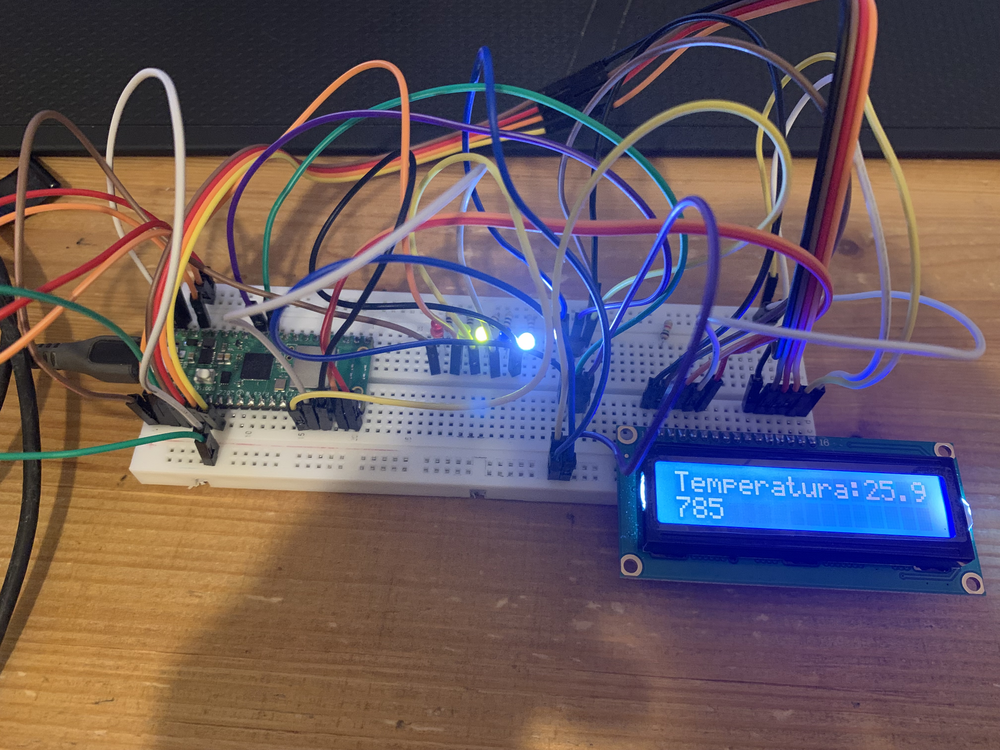
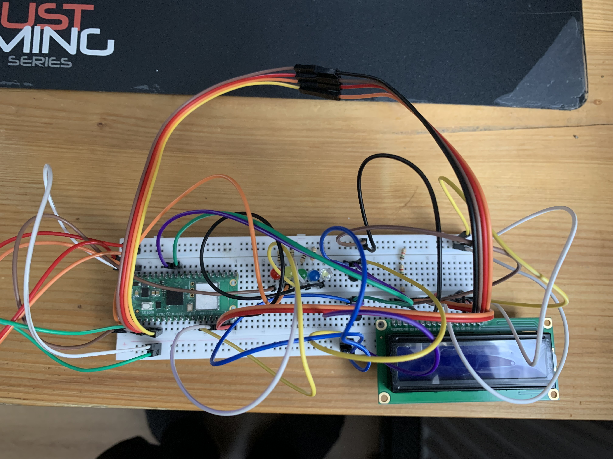
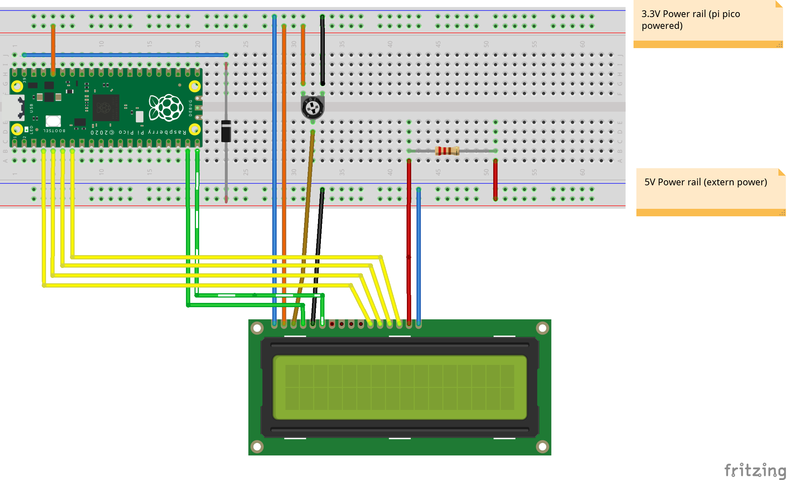

# Raspberry-pi-pico-thermomentr

## Dependency

```sh
cd /..
git clone -b 1.4.0 --recursive https://github.com/raspberrypi/pico-sdk.git
git clone --recursive  https://github.com/martinkooij/pi-pico-LCD
cd Raspberry-pi-pico-thermomentr
git submodule update --init --recursive
```

## Compile

```sh
mkdir build
cd build
cmake ..
cmake --build . -j
```

## Necessery component

1) Raspberry pi pico
2) 5 * Led diodes
3) Resistors 1,5k and 0,1 omm
4) LCD display 2 x 16 (JUS-19732)
5) Sensors (LM35DZ NS) x 2
6) Wires a lot of

## Layout





### Display connection
